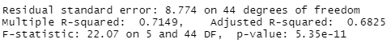
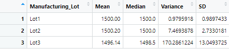
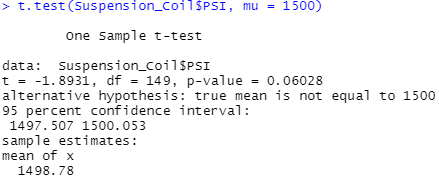
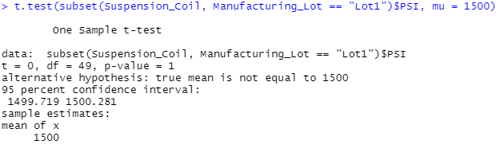
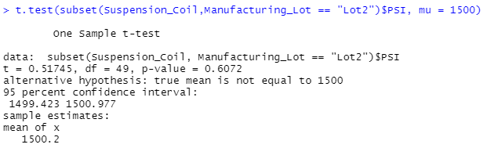
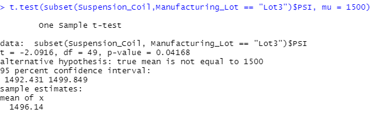

# MechaCar_Statistical_Analysis

## Linear Regression to Predict MPG

- There is a non-random amount of variance within the following: vehicle_weight, vehicle_length, and ground clearance.
- THe slope of the linear regression is not zero because the p-value is equal to 5.35 x 10^(-11), which is less than the 0.05% significance level.
- Based on the multiple R-squared (about 71.5%), the linear model predicts mpg of MechaCar prototypes effectively.

## Summary Statistics on Suspension Coils

It is specified that the PSI of suspension coils should not exceed 100. When examining each lot individually, it is seen that the variance for lots 1 and 2 meet this requirement. However, lot 3's variance exceeds 100 PSI.   
  

When looking at all 3 lots summarized, it is shown that the PSI of the suspension coils meets the specification, as the variance is only about 62.3.   
  

## T-Tests on Suspension Coils

Four t-tests were conducted in total: 1 that used data on all 3 suspension coil lots, and then 1 test for each individual lot's data. A significance level of 0.05 was used for all four t-tests. 

For the t-test that used data on all 3 lots, a p value of 0.06 was found. As this is greater than the significance level of 0.05, it is evident that the two means are statistically similar.   
   

For the t-test that used data on lot 1, a p value of 1 was found. As this is greater than the significance level of 0.05, the two means are statistically similar.   
   

For the t-test that used data on lot 2, a p value of 0.61 was found. As this is greater than the significance level of 0.05, the two means are statistically similar.   
   

For the t-test that used data on lot 0.04, a p value of 0.06 was found. As this is less than the significance level of 0.05, it is evident that the two means are not statistically similar.   
   

## Study Design: MechaCar vs Competition

As car designs have evolved over the decades, Americans have begun buying bigger and bigger cars. Some American car manufacturers, such as Ford, have even said that sedan demand has dropped so much that they would cease most production by the end of the 2020s. While this does not necessarily mean that a bigger car is always better than a smaller one, it does show a clear trend in consumer preferences. Therefore, a statistical test could be run between MechaCar sizes and that of their leading competitor. A two sample t-test would be run using metrics such as:

- Height 
- Width 
- Weight
- Trunk space

The null hypothesis would be that the average car sizes of MechaCar and their competitor are statistically similar, while the alternative hypothesis would be that they are not statistically similar. 
